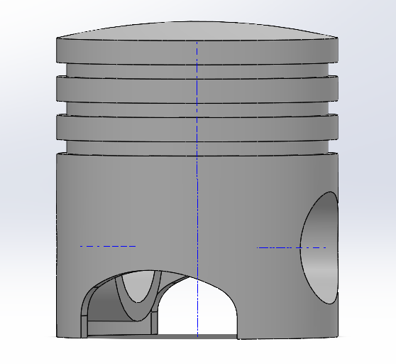

# - SolidWorks Engine -

<h2> Description </h2>

I built an Inline 4 cylinder cranktrain using CAD. As someone with a deep interest in vehicles, specifically propulsion systems, I thought it would be a fun project to build an engine.
I plan to also create the engine block at a later date to complete the whole engine. 

Bellow is a complete account of how I made the engine, including photos and videos of the engine as well as recourses I used to learn from.

This being my second time using SolidWorks I felt much more confident going into the project. The main goal was to further enhance my CAD skills from what I was required to know for my course. 

Because I aimed to improve my CAD I used an already designed engine to build instead of creating it purely originally, I will show photos of the resource I used to build the parts.

<h2> CAD Software Used </h2>
- SolidWorks

<h2> Process </h2>

I created each part separately, then used the assembly to mate the parts and move the engine.

First I created the piston which wasnt as hard as some of the other parts, it taught me to use repeated patterns to make multipe cuts faster.

  
   
  <em>SolidWorks engine assembly</em>

  
  
 
